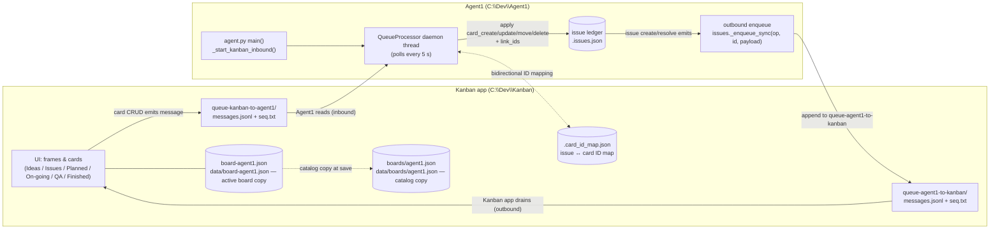
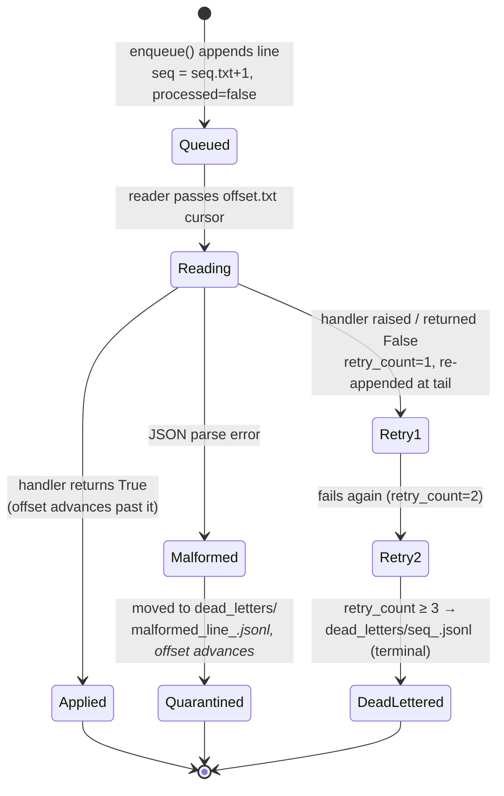
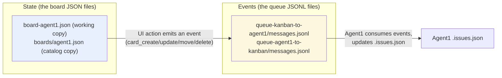
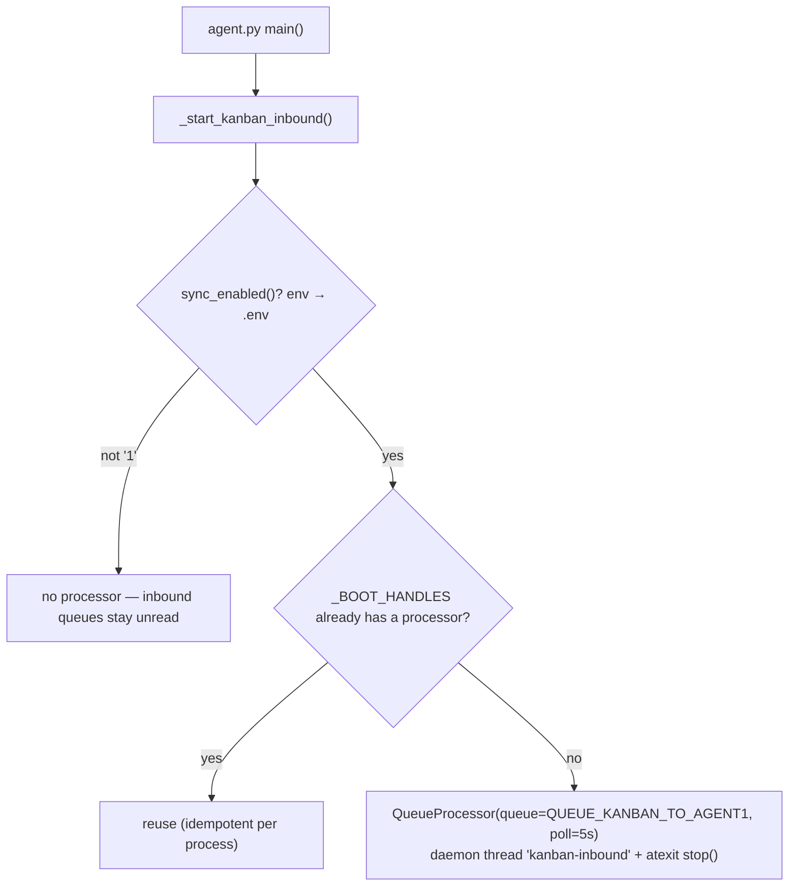

# Integration of Kanban and Agent1 — How It Works

This document describes how the Kanban app and Agent1 exchange data **today**, based on
the current code (`harnessfix/kanban_bridge.py`, `harnessfix/issues.py`, `agent.py`),
not on the older design notes in `Integation of Kanban and Agent1.txt`.

Key point up front: the integration is a **message-queue bridge over two JSONL queue
directories** that live under `C:\Dev\Kanban\data\`. It is **not** a direct file sync of
`board-agent1.json`, and there is no automatic pipeline from `data\boards\agent1.json`
into Agent1. The board files are the Kanban app's own persistence; only *actions*
(create / update / move / delete cards) produce queue messages that Agent1 consumes.

---

## 1. System overview (topology)



Notes:
- `active.json` in the Kanban data dir names the active board (`{"active": "agent1"}`);
  both sides read it, and per-board sync opt-in is stored in the board file's top-level
  `"sync"` map (e.g. `"sync": {"agent1": true}`).
- Both repos resolve `KANBAN_WORKING_DIR` to the **same physical directory** — that shared
  dir *is* the integration surface. Agent1's own `data\boards\` and legacy `queue-kanban-in/-out`
  directories are not used by the bridge.

## 2. Directory layout of the shared data root (`C:\Dev\Kanban\data`)

```mermaid
flowchart TD
    DATA["C:\\Dev\\Kanban\\data  (KANBAN_WORKING_DIR — single source of truth)"]
    DATA --> ACTIVE["active.json — which board is active, e.g. {\"active\": \"agent1\"}"]
    DATA --> BOARD["board-agent1.json — working copy of the Agent1 board<br/>(frames, cards, sync map)"]
    DATA --> BOARDS["boards/agent1.json — catalog copy written by the Kanban app"]
    DATA --> QIA["queue-kanban-to-agent1/<br/>messages.jsonl · seq.txt (writer counter) · offset.txt (reader cursor)"]
    DATA --> QAO["queue-agent1-to-kanban/<br/>messages.jsonl · seq.txt · offset.txt"]
    DATA --> IDMAP[".card_id_map.json — bidirectional issue↔card map<br/>(also .agent1_card_id_map.json exists as a legacy copy)"]
```

Queue file anatomy (one JSON object per line, append-only):

```json
{"op": "card_move", "source_id": "<card-guid>", "payload": {"frame_id": "<id>", "frame_title": "Issues"},
 "ts": "2026-10-09T22:33:39+00:00", "seq": 31, "retry_count": 0, "processed": false}
```

- `seq.txt` — the **writer's** sequence counter (must never be shared with the cursor).
- `offset.txt` — the **reader's** cursor; lines before it are considered consumed.
- A message that fails `MAX_RETRIES = 3` times is moved to `<queue>/dead_letters/`.

## 3. Kanban → Agent1: inbound flow (a card move)

```mermaid
sequenceDiagram
    autonumber
    participant U as User (Kanban UI)
    participant K as Kanban app
    participant Q as queue-kanban-to-agent1/<br/>messages.jsonl
    participant P as QueueProcessor<br/>(Agent1 daemon thread)
    participant B as kanban_bridge
    participant I as harnessfix/issues.py<br/>(.issues.json)

    U->>K: Drag card from "Planned" to "Issues" frame
    K->>Q: append {op:"card_move", source_id:<br/>card_guid, payload:{frame_title:"Issues"}, ts}
    Note over Q: seq advanced in seq.txt
    P->>Q: poll (every 5 s): read from offset.txt
    P->>B: process_inbound → _process_single_message(msg)
    B->>B: card_move → resolve_id(card_guid, .card_id_map.json)<br/>→ issue id; frame_title → FRAME_TO_STATUS → "open"
    alt mapping/issue found
        B->>I: load_issues(); existing["status"] = "open"; save_issues()
        B-->>P: True (applied)
        P->>Q: advance offset.txt past the line
    else no matching issue
        B-->>P: False → _record_failure: retry_count+1,<br/>re-append at tail; ≥3 fails → dead_letters/
    end
```

Frame title → issue status mapping (`FRAME_TO_STATUS` in `kanban_bridge.py`):

| Kanban frame (column title) | Agent1 issue status |
|---|---|
| Issues | open |
| Planned | planned |
| On-going | in-progress |
| Quality & Assurance | reviewing |
| Finished | resolved |

(There is no mapping for a "Done" frame — moves there fall back to `open`.)

## 4. Agent1 → Kanban: outbound flow

```mermaid
sequenceDiagram
    autonumber
    participant A as Agent1 logic<br/>(issue collector, resolve, promote)
    participant S as issues._should_sync() gate
    participant E as kanban_bridge.enqueue
    participant Q as queue-agent1-to-kanban/<br/>messages.jsonl
    participant K as Kanban app

    A->>S: issue created / resolved / promoted
    S->>S: layer 1 — sync_enabled():<br/>KANBAN_SYNC_ENABLED env, then repo .env == "1"?
    S->>S: layer 2 — active_board_allows_agent1():<br/>active.json → board-<id>.json → "sync"."agent1" is truthy?
    alt both gates pass (fail-closed otherwise)
        S->>E: enqueue({op:"issue_create|issue_update|issue_resolve", source_id, payload})
        E->>Q: atomic append + fsync; seq = seq.txt+1
        K->>Q: Kanban drains the queue (creates/updates cards on its side)
    else any gate fails
        S-->>A: nothing enqueued — message NOT queued<br/>(board queues are held, not discarded)
    end
```

## 5. Two-layer sync gate (decision flow)

```mermaid
flowchart TD
    A["An issue changes in Agent1"] --> B{"process env KANBAN_SYNC_ENABLED set?"}
    B -- yes --> C1{"value == \"1\""}
    B -- no --> C2{"repo .env KANBAN_SYNC_ENABLED == \"1\"<br/>(_read_env_file_value)"}
    C1 -- no --> OFF["SYNC OFF — enqueue nothing (fail closed)"]
    C2 -- no --> OFF
    C1 -- yes --> D["active_board_allows_agent1()"]
    C2 -- yes --> D
    D --> E{"active.json → active board id<br/>resolves to board-<id>.json?"}
    E -- "missing / malformed / path-like id" --> OFF
    E -- ok --> F{"board top-level \"sync\" map has<br/>\"agent1\": true ?"}
    F -- no/absent/falsy --> OFF
    F -- yes --> G["ENQUEUE message to queue-agent1-to-kanban"]
```

Both layers are read from disk on **every** call, so toggling the board in the Kanban UI
takes effect immediately without restarting Agent1.

## 6. ID mapping (`.card_id_map.json`) — how a card finds its issue

```mermaid
flowchart LR
    subgraph MAPFILE[".card_id_map.json (stored in the Kanban data root)"]
        direction TB
        M1["\"iss-general-kanban_f01a…\" ↔ \"f01a7cb8fb514e7d8e48f8d224b66d24\"<br/>(issue id ↔ card guid, stored BOTH directions)"]
    end
    subgraph WRITE["Written by"]
        W["_apply_card_create: make_issue(...)<br/>→ save → link_ids(issue_id, card_id)"]
    end
    subgraph READ["Read by"]
        R1["card_update / card_move / card_delete:<br/>resolve_id(source_id=card_guid) → issue id"]
    end
    WRITE --> MAPFILE --> READ
```

The mapping is bidirectional: `mapping[issue_id] = card_id` **and** `mapping[card_id] = issue_id`.
Every inbound handler looks up the card guid via the map; if it resolves to nothing, the
message logs "no matching issue" and fails (retry/dead-letter). This is why a card that was
never *created through the bridge* (added directly on the Kanban board) has no mapping entry —
and why earlier versions with one-directional maps silently broke all follow-up updates.

## 7. Message lifecycle (queue state machine per message)



## 8. Board files vs queues — the mental model



The bridge is **event-sourced**: the board files are *state*, the queues carry *events*.
Nothing in Agent1 reads `board-agent1.json` or `boards/agent1.json` directly — they are
never "synced". A card move only reaches Agent1 if a `card_move` event line was appended
to `queue-kanban-to-agent1\messages.jsonl`.

## 9. Inbound handler reference (what each op does to `.issues.json`)

| op | handler | effect on issue | requires map hit? |
|---|---|---|---|
| `card_create` | `_apply_card_create` | builds + **persists** a new issue (`make_issue` → upsert → save), then `link_ids(issue, card)`; tags `[category]`, `[severity:x]`, `[status:y]`; text split on `\n\n---\n` into evidence / approach | creates the mapping |
| `card_update` | `_apply_card_update` | updates title / appends `[note]` to evidence / replaces suggested_approach and status; saves ledger | yes (via source_id) |
| `card_move` | `_apply_card_move` | sets issue `status` from `FRAME_TO_STATUS[frame_title]`; stamps `resolved_at` on resolved/wontfix transitions | yes (via source_id) |
| `card_delete` | `_apply_card_delete` | resolves the issue with disposition `wontfix`, note "Card deleted from Kanban" | yes (via source_id) |

## 10. Boot wiring (who runs the reader)



Manual one-shot processing: `python -m harnessfix.kanban_bridge --process-in` (alias `--process`).

## 11. Historical defects this design fixed (why the code looks like this)

| Commit | Defect it closed |
|---|---|
| `3ae4af9` feat(sync) | Introduced the enqueue hook + bridge |
| `4997765` fix(kanban) | Created issues were never persisted (phantom mappings); moves resolved by frame *id* (never matched, always fell back to "open"); malformed lines re-read forever — now quarantined |
| `15adbdc` fix(sync) | Inbound poller was never wired into boot — all inbound messages sat unread; now `_start_kanban_inbound()` in `agent.py:main()` |
| `01e67b2` / `4054853` | `.env` master switch was dead (only env var counted); per-board opt-in added as a second layer, fail-closed |

## 12. Operational checklist (why "the file is not updated")

If you move a card and see no effect on Agent1:

1. **Is the inbound queue being written?** Check `C:\Dev\Kanban\data\queue-kanban-to-agent1\messages.jsonl`
   — your move should be the last line, with `"op": "card_move"` and a fresh `ts`. If no new line exists,
   the Kanban app did not emit an event (e.g. the board's sync toggle is off, or you moved in a
   non-synced board).
2. **Is Agent1 running with sync enabled?** The reader only lives inside the agent process.
   `KANBAN_SYNC_ENABLED=1` must be set (env wins, repo `.env` fallback), then restart/start Agent1 —
   the poller runs every 5 s. One-shot: `python -m harnessfix.kanban_bridge --process-in`.
3. **Is a sync-enabled board active?** `active.json` → `board-<id>.json` must have `"sync": {"agent1": true}`.
4. **Does the card map know this card?** A card added directly on the board has no issue mapping;
   moves/updates of it resolve to nothing and dead-letter after 3 tries. Check `.card_id_map.json`.
5. **`boards\agent1.json` will never update from Agent1 automatically** — it is only written by the
   Kanban app when that board saves. Outbound replies land in `queue-agent1-to-kanban\messages.jsonl`;
   the Kanban app drains them into its own board state.

---
*Generated 2026-10-15 from: harnessfix/kanban_bridge.py (full read), harnessfix/issues.py (sync gate + enqueue hook), agent.py (_start_kanban_inbound, main), sync_kanban_to_agent1.py, live data under C:\Dev\Kanban\data (active.json, board-agent1.json with 7 frames / 95 cards, queue seq=12 offset=31, .card_id_map.json with 74 entries).*
