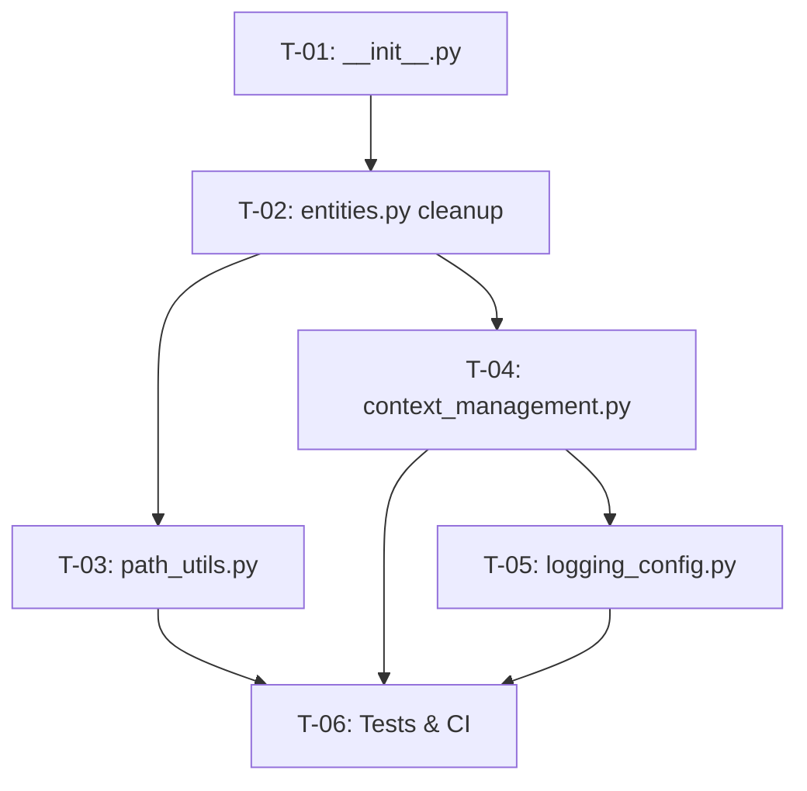

# Implementation Tasks

# 📋 Implementation Task Plan: Agent Core Framework Refactoring & Hardening

## 🔑 Key Principles
- **Single Source of Truth**: `entities.py` owns all exceptions, configs, models, and type aliases. New modules must import from it; zero redefinition allowed.
- **Priority Model**: `P0` = Critical/Blocking (security, structure, CI) | `P1` = High Impact (observability, async safety, quality)
- **Python Target**: 3.10+ (`str | Path`, PEP 604 unions, modern `pathlib`)
- **Verification**: Every task includes explicit acceptance criteria and validation commands.

---

## 📂 Module-by-Module Tasks

### 1️⃣ `agent_core/__init__.py` (New)
| Task ID | Description | Priority | Dependencies |
|---------|-------------|----------|--------------|
| **T-01** | Initialize package structure & public API surface | P0 | None |

**Action Steps:**
1. Create directory: `agent_core/` and touch `__init__.py`.
2. Define `__all__` exporting only stable public symbols:
   ```python
   __all__ = [
       "AgentError", "FileOperationError", "ToolExecutionError", 
       "SecurityViolationError", "SemanticIndexError",
       "validate_path", "WorkspaceSandbox",
       "CorrelationIdContext", "setup_logging",
       "AgentConfig", "FileSystemConfig", "LLMConfig"
   ]
   ```
3. Use relative imports to pull symbols from submodules (`from .entities import ...`, etc.).
4. Add package-level docstring with version, purpose, and usage example.

**Acceptance Criteria:**
- `python -c "import agent_core; print(agent_core.__all__)"` succeeds without circular import errors.
- `mypy --strict agent_core/__init__.py` passes cleanly.
- No internal implementation details leak into public namespace.

---

### 2️⃣ `agent_core/entities.py` (Existing - Validation & Cleanup)
| Task ID | Description | Priority | Dependencies |
|---------|-------------|----------|--------------|
| **T-02** | Validate syntax, imports, and alignment with refactoring plan | P0 | None |

**Action Steps:**
1. Verify all required standard library imports are present (`contextvars`, `uuid`, `json`, `traceback`, `logging`). Add if missing.
2. Remove any inline spec tags like `(Phase 4.1)` or `[PATH-01]` that break linter parsing. Move tracking metadata to module docstring or external docs.
3. Confirm exception hierarchy matches plan: `Exception → AgentError → {FileOperation, ToolExecution, SecurityViolation, SemanticIndex}`. Ensure **no built-in shadowing** (e.g., verify `TimeoutError` is not defined anywhere).
4. Run static analysis to validate type hints (`str | Path`, frozen dataclasses, generic bounds).

**Acceptance Criteria:**
- File compiles without syntax errors: `python -m py_compile agent_core/entities.py`
- All dataclasses are importable and instantiate correctly with default factories.
- Zero lint/type violations under `ruff check --select E,F,I,N,RUF` and `mypy --strict`.

---

### 3️⃣ `agent_core/path_utils.py` (New)
| Task ID | Description | Priority | Dependencies |
|---------|-------------|----------|--------------|
| **T-03** | Implement secure path validation & workspace sandboxing | P0 | `entities.py` |

**Action Steps:**
1. Import `Path`, `SecurityViolationError`, `FileOperationError` from `.entities`.
2. Implement `_validate_path(raw: str, workspace_root: Path, follow_symlinks: bool = True) -> Path`:
   - Reject empty/non-string inputs → `FileOperationError`
   - Resolve path with `Path.resolve(strict=False)`
   - Enforce boundary using `target.relative_to(workspace_root.resolve())` → raise `SecurityViolationError` on `ValueError`
   - If `follow_symlinks=False`, check `target.is_symlink()` and reject if true.
3. Build `WorkspaceSandbox(workspace_root: Path, follow_symlinks: bool = True)` context manager:
   - Store validated root in instance state
   - Provide `.resolve_path(raw: str) -> Path` method wrapping `_validate_path`
   - Implement `__enter__`/`__exit__` for declarative scoping
4. Add module docstring with security guarantees and usage examples.

**Acceptance Criteria:**
- Blocks `../`, absolute escapes, and malformed inputs deterministically.
- Symlink policy flag works correctly; rejects cross-boundary symlinks when disabled.
- Integrates cleanly with `SecurityViolationError` from `entities.py`.
- Passes path traversal unit tests (see T-06).

---

### 4️⃣ `agent_core/context_management.py` (New)
| Task ID | Description | Priority | Dependencies |
|---------|-------------|----------|--------------|
| **T-04** | Implement async-safe correlation tracking & context propagation | P1 | None |

**Action Steps:**
1. Import `contextvars`, `uuid`. Define module-level:
   ```python
   CORRELATION_ID_CTX: ContextVar[str] = ContextVar("correlation_id", default="")
   ```
2. Implement `CorrelationIdContext(corr_id: str | None = None)`:
   - Store `_token: Token[str] | None` and `_corr_id`
   - `__enter__`: set context var, return ID
   - `__exit__`: reset token if present, ignore exception types
3. Add utility function `copy_correlation_context()` → returns `contextvars.copy_context()` for executor/task submission.
4. Ensure thread/async task isolation by documenting required usage pattern: `loop.run_in_executor(None, ctx.run, target)`

**Acceptance Criteria:**
- Context variable does not leak across concurrent `asyncio` tasks or thread pool workers.
- Token cleanup verified under normal exit and exception paths.
- `pytest` async isolation tests confirm zero cross-task contamination.

---

### 5️⃣ `agent_core/logging_config.py` (New)
| Task ID | Description | Priority | Dependencies |
|---------|-------------|----------|--------------|
| **T-05** | Build structured JSON logging pipeline with correlation injection | P1 | `context_management.py`, `entities.py` |

**Action Steps:**
1. Import `logging`, `json`, `datetime`, `Path`, `Exception`.
2. Implement `SafeJsonEncoder(json.JSONEncoder)`:
   - Handle `datetime`, `Path`, `UUID`, custom dataclasses via `__dict__` or `asdict()`
   - Fallback to `str(obj)` for unknown types
3. Create `CorrelationIdFilter(logging.Filter)`:
   - Inject `CORRELATION_ID_CTX.get()` into log record as `correlation_id` field
4. Implement `setup_logging(level: int = logging.INFO, json_format: bool = True) -> None`:
   - Use `logging.config.dictConfig()` for declarative setup
   - Configure console handler with safe encoder & correlation filter
   - Set propagation=False to prevent duplicate root logs
5. Document async compatibility notes (loggers are thread-safe by default; context vars require explicit copying in executors).

**Acceptance Criteria:**
- JSON output parses without `TypeError` for edge payloads (`datetime`, `Path`, exceptions, nested dataclasses).
- Correlation ID appears consistently in every log record within a context scope.
- No performance regression on standard logging calls (<50µs overhead per call).

---

### 6️⃣ Testing & CI Infrastructure (New)
| Task ID | Description | Priority | Dependencies |
|---------|-------------|----------|--------------|
| **T-06** | Implement unit tests, property-based fuzzing, and CI pipeline | P0/P1 | All modules above |

**Action Steps:**
1. Create `tests/` directory with `conftest.py`:
   - Configure `pyfakefs` for deterministic filesystem mocking
   - Add pytest-asyncio event loop scope configuration
2. Write test suites:
   - `test_path_utils.py`: traversal attempts, symlink loops, boundary enforcement, sandbox context manager
   - `test_context_management.py`: async task isolation, token reset on exceptions, executor propagation
   - `test_logging_config.py`: JSON serialization edge cases, correlation ID injection, filter behavior
3. Add property-based tests with `hypothesis` for `_validate_path()` (fuzz random relative/absolute paths)
4. Create `.github/workflows/ci.yml`:
   - Steps: lint (`ruff`), type-check (`mypy --strict`), test (`pytest --cov=agent_core --cov-fail-under=80`), security scan (`bandit`)
   - Cache dependencies, fail fast on any stage

**Acceptance Criteria:**
- Coverage ≥ 80% across `agent_core/`
- Zero flaky tests; deterministic FS mocking via `pyfakefs`
- CI pipeline green on push/PR; artifacts include coverage HTML & SARIF security report.

---

## 🔗 Dependency Matrix & Execution Order



**Recommended Sprint Flow:**
1. **Days 1-2**: Complete T-01 → T-02 → T-03 (Structure + Security)
2. **Days 3-4**: Complete T-04 → T-05 (Observability + Async Safety)
3. **Days 5-6**: Complete T-06 (Tests + CI), run integration validation, merge to `main`

---

## ✅ Cross-Module Contract Checklist
| Module | Required Imports from `entities.py` | Forbidden Actions |
|--------|-------------------------------------|-------------------|
| `path_utils.py` | `SecurityViolationError`, `FileOperationError`, `Path` | Do not redefine exceptions or configs |
| `context_management.py` | None (standalone) | Do not modify `ContextVar` default values at runtime |
| `logging_config.py` | `AgentConfig`, dataclasses (`LLMConfig`, etc.) for encoder fallback | Do not mutate frozen dataclasses; use `asdict()` or safe serialization |
| All modules | Use `str | Path` union syntax consistently | No legacy `typing.Union`/`Optional`; no inline spec tags in code |

---

## 🛠️ Validation Commands (Run per phase)
```bash
# Phase 1 & 2: Structure + Security
python -m compileall agent_core/
ruff check agent_core/ --fix
mypy --strict agent_core/path_utils.py agent_core/entities.py

# Phase 3: Context + Logging
pytest tests/test_context_management.py tests/test_logging_config.py -v
python -c "from agent_core import setup_logging, CorrelationIdContext; print('Logging & context OK')"

# Phase 4-5: Full Suite + CI Simulation
pytest --cov=agent_core --cov-report=term-missing
bandit -r agent_core/ -ll
```

This task plan is ready for direct handoff to engineering. Each module has explicit boundaries, respects the canonical `entities.py` definitions, and includes measurable acceptance criteria aligned with production readiness standards.